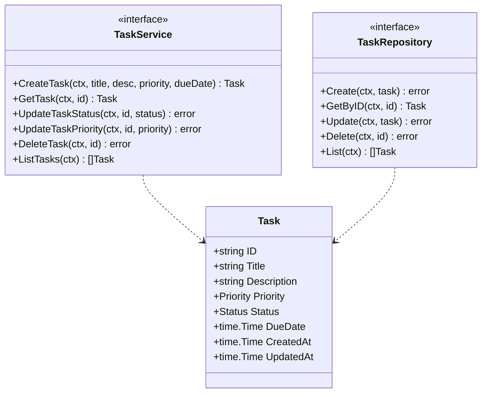
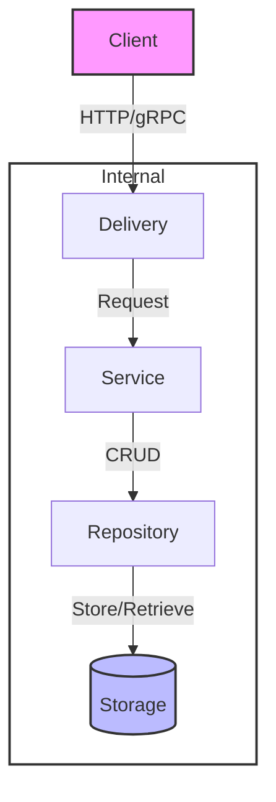

# Task Manager

A task management system developed in Go, supporting multiple API integration methods.

> **Note**: This project is developed in collaboration with Cursor IDE for learning purposes, exploring best practices in Go development and software architecture.

## Directory Structure

```
.
├── README.md
├── go.mod
├── go.sum
└── internal/
    ├── domain/             # Domain models and core interface definitions
    │   └── task.go         # Task-related domain models and interfaces
    │
    ├── repository/         # Data storage layer implementation
    │   └── memory/         # In-memory storage implementation
    │       └── task.go
    │
    ├── service/           # Business logic layer
    │   └── task/          # Task service implementation
    │       └── service.go
    │
    └── delivery/          # API transport layer
        ├── rest/          # RESTful API implementation
        │   └── handler.go
        │
        ├── graphql/       # GraphQL API implementation
        │   └── handler.go
        │
        └── grpc/         # gRPC API implementation
            └── handler.go

└── pkg/                  # Reusable packages
    └── validator/        # Validator implementation
        ├── task.go       # Task-related validation rules
        └── validator.go  # Common validation logic

```

## Architecture Overview

- **Domain Layer**: Defines core business models and interfaces
- **Repository Layer**: Implements data persistence
- **Service Layer**: Implements core business logic
- **Delivery Layer**: Provides multiple API access methods
  - RESTful API
  - GraphQL API
  - gRPC API

## System Design

### Component Architecture

```mermaid
graph TB
    subgraph Delivery["Delivery Layer"]
        REST["REST API Handler"]
        GraphQL["GraphQL Handler"]
        GRPC["gRPC Handler"]
    end

    subgraph Service["Service Layer"]
        TaskService["Task Service"]
    end

    subgraph Domain["Domain Layer"]
        ITaskService["TaskService<br/><interface>"]
        ITaskRepo["TaskRepository<br/><interface>"]
        ITaskValidator["TaskValidator<br/><interface>"]
        ITaskNotifier["TaskNotifier<br/><interface>"]
    end

    subgraph Repository["Repository Layer"]
        MemRepo["Memory Repository"]
    end

    subgraph Validator["Validator Package"]
        TaskValidator["Task Validator"]
        IBaseValidator["BaseValidator<br/><interface>"]
        ValidationRules["Validation Rules"]
    end

    %% Dependencies
    REST --> ITaskService
    GraphQL --> ITaskService
    GRPC --> ITaskService

    TaskService -.-> ITaskService
    TaskService --> ITaskRepo
    TaskService --> ITaskValidator
    TaskService --> ITaskNotifier

    MemRepo -.-> ITaskRepo

    TaskValidator -.-> ITaskValidator
    TaskValidator --> IBaseValidator
    TaskValidator --> ValidationRules

    %% Styling
    classDef interface fill:#f0f0f0,stroke:#333,stroke-width:2px
    classDef component fill:#fff,stroke:#333,stroke-width:2px
    classDef layer fill:none,stroke:#333,stroke-width:2px,stroke-dasharray: 5 5

    class ITaskService,ITaskRepo,ITaskValidator,ITaskNotifier,IBaseValidator interface
    class REST,GraphQL,GRPC,TaskService,MemRepo,TaskValidator,ValidationRules component
    class Delivery,Service,Domain,Repository,Validator layer
```



### Domain Model



### Architecture Flow



## Design Principles

This project follows SOLID principles:

1. **Single Responsibility Principle (SRP)**
   - Each package has a clear, single responsibility
   - Clear separation of responsibilities between layers

2. **Open-Closed Principle (OCP)**
   - Extensions implemented through interface definitions
   - New features can be added without modifying existing code

3. **Liskov Substitution Principle (LSP)**
   - All implementations can substitute their interfaces
   - Ensures system testability

4. **Interface Segregation Principle (ISP)**
   - Interfaces are concise and focused
   - Clients only depend on interfaces they need

5. **Dependency Inversion Principle (DIP)**
   - High-level modules don't depend on low-level modules
   - All depend on abstract interfaces

## Development Plan

- [x] Basic infrastructure setup
- [x] Core domain model implementation
- [x] Storage layer implementation
- [x] RESTful API implementation
- [ ] GraphQL API implementation
- [ ] gRPC API implementation
- [ ] Unit test coverage
- [ ] Performance testing and optimization 